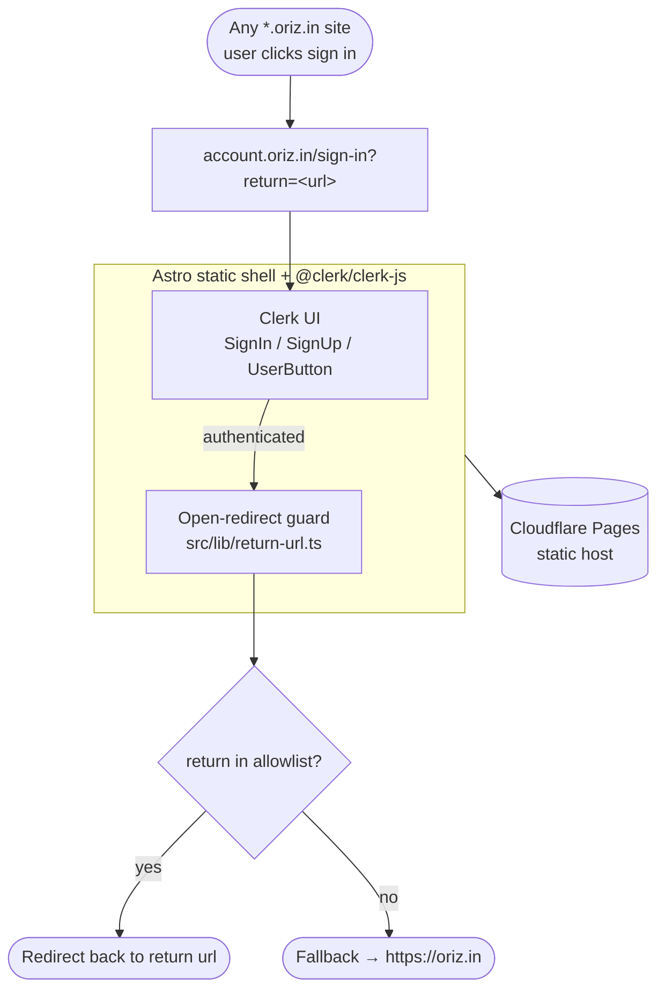

# oriz-auth-app

> oriz central auth — Clerk-powered SSO hub for `*.oriz.in`.

[](LICENSE)
[](https://github.com/chirag127/oriz-auth-app/stargazers)
[](https://github.com/chirag127/oriz-auth-app/commits)
[](https://astro.build)

**Live app:** https://account.oriz.in (also https://auth.oriz.in) · **About:** https://chirag127.github.io/oriz-auth-app/ · **Repo:** https://github.com/chirag127/oriz-auth-app

The central Clerk-powered auth hub for the **oriz.in** family — one identity with cross-subdomain SSO for every `*.oriz.in` site. This is not a consumer tool; it's the shared SSO surface the rest of the fleet redirects to for sign-in and account management. Sign-in requests carry a `return` URL, which is validated against an allowlist to prevent open redirects before the browser is sent back.

⭐ If you find the fleet useful, a [star](https://github.com/chirag127/oriz-auth-app/stargazers) is appreciated.

## How it works



## What it does

- **Real Clerk UI** (`@clerk/clerk-js`): `<SignIn/>`, `<SignUp/>`, `<UserButton/>` — Google, GitHub, email, passkeys, MFA.
- **Cross-subdomain SSO** across `*.oriz.in` (Clerk default with a `pk_live_` production key on the `clerk.oriz.in` FAPI).
- **Return-URL flow** — sites send users to `https://account.oriz.in/sign-in?return=<url>`; after auth the browser is sent back to `<url>`.
- **Open-redirect guard** — the `return` param is validated against an allowlist before use — see `src/lib/return-url.ts`.

### Return-URL allowlist

| Allowed | Example |
| --- | --- |
| `https://oriz.in` | `https://oriz.in/dashboard` |
| `https://*.oriz.in` | `https://finance.oriz.in/app` |
| `http://localhost:*` (dev) | `http://localhost:4321/` |
| `http://127.0.0.1:*` (dev) | `http://127.0.0.1:3000/` |

Anything else → falls back to `https://oriz.in`.

### Pages

| Route | Purpose |
| --- | --- |
| `/` | Client-side redirect → `/account` (signed in) or `/sign-in` |
| `/sign-in` | Clerk `<SignIn/>` |
| `/sign-up` | Clerk `<SignUp/>` |
| `/account` | Clerk `<UserButton/>`; bounces to `/sign-in` if signed out |

## Tech stack

- **Astro 6** static output (no React island framework here — plain Astro + Clerk JS).
- **[@clerk/clerk-js](https://clerk.com/docs)** — hosted-quality auth UI, providers, passkeys, MFA.
- **Shared `@chirag127/oz-*` packages** — `oz-chrome` / `oz-tokens-base` for shell and tokens.
- **Cloudflare Pages** — static hosting (project `oriz-auth-app`).

## Repo structure

```
oriz-auth-app/
├── src/
│   ├── pages/          # / · /sign-in · /sign-up · /account
│   ├── lib/
│   │   └── return-url.ts  # open-redirect guard + allowlist validation
│   ├── layouts/        # base HTML layout / meta
│   └── styles/         # Tailwind entry + theme tokens
├── public/            # static assets, icons
└── astro.config.mjs   # Astro config
```

## Screenshots

See the live sign-in at **https://account.oriz.in**.

## Quick start

```bash
cp .env.example .env               # set PUBLIC_CLERK_PUBLISHABLE_KEY (pk_live_… — browser-safe)
npm install --legacy-peer-deps
npm run dev                        # local dev
npm run typecheck                  # astro check
npm run build                      # static build → dist/
npm run deploy:pages               # wrangler pages deploy dist --project-name=oriz-auth-app
```

There is no test suite for this hub; scripts are `dev` / `build` / `preview` / `deploy:pages` / `typecheck`.

## Configuration

| Env var | Purpose |
| --- | --- |
| `PUBLIC_CLERK_PUBLISHABLE_KEY` | Clerk publishable key (`pk_live_…`) — client-only, safe to ship in the browser bundle. |

## Security

- **No plaintext secrets in the repo.** `.env.enc` is **sops + age** encrypted.
- `PUBLIC_*` keys are **client-only** (publishable) and safe in the browser bundle.
- The Clerk **secret key is never used here** and must never be committed.
- The `return` param is always validated against the allowlist above before redirect (open-redirect guard in `src/lib/return-url.ts`).

## Part of the oriz family

The SSO hub for ~80 sites in the [oriz](https://blog.oriz.in) family — a fleet that runs **$0 on the Cloudflare free tier**.

> **Hosting:** the canonical live app is served from **Cloudflare Pages** at [account.oriz.in](https://account.oriz.in). GitHub Pages serves a separate info/landing page at [chirag127.github.io/oriz-auth-app](https://chirag127.github.io/oriz-auth-app/).

## Related projects

- [oriz-finance](https://github.com/chirag127/oriz-finance) — finance calculators (uses this SSO to gate account features).
- [oriz-chat](https://github.com/chirag127/oriz-chat) — free client-side AI chat.
- [oriz-text](https://github.com/chirag127/oriz-text) — writing-desk text toolkit.
- [oriz-color](https://github.com/chirag127/oriz-color) — color studio.

## Contributing

Issues and PRs welcome. Conventional commits are the changelog.

## Status

Stable.

## License

MIT © 2026 Chirag Singhal · chirag@oriz.in
